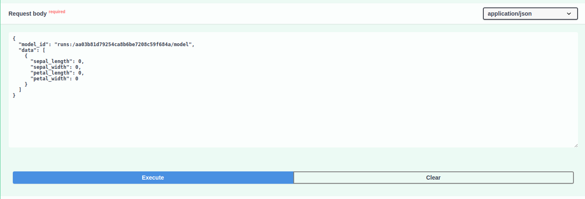

# Iris

This project aims to create a ML system that can predict the species of an iris flower based on the length and width of its petals and sepals. To do this, this project provides a REST API that can be used to predict the species synchronously and also using asynchronous tasks. Another great feature is the possibility to train the model using the API and monitoring the training process using [MLFlow](http://mlflow.org), in addition to the possibility to version the model and use it by the API.

## How to run

To run this application, you need to clone the repository by:

`git clone https://github.com/jpfcabral/iris.git && cd iris`

Sometimes you need to set permissions to copy `.sh` files into the container

`chmod +x ./build/wait-for-it.sh`

After that, you can run using docker-compose:

`docker compose up --build`

## How to test

To test this application, you need to clone the repository by:

`git clone https://github.com/jpfcabral/iris.git && cd iris`

Then, you need to install the dependencies:

`pip install -U pipenv && pipenv install`

After that, you can run the tests using the following command:

`pipenv run unittests`

You should see the following output:

```
---------- coverage: platform linux, python 3.11.3-final-0 -----------
Name                   Stmts   Miss  Cover   Missing
----------------------------------------------------
app/__init__.py            0      0   100%
app/config.py              7      0   100%
app/iris/__init__.py       0      0   100%
app/iris/models.py        19      0   100%
app/iris/services.py      21      1    95%   20
app/iris/tasks.py         68      9    87%   56, 89-97
app/iris/views.py         38      1    97%   68
app/main.py                7      0   100%
----------------------------------------------------
TOTAL                    160     11    93%
```

NOTE: The training tests/code should be upgrated to make sure about the real behavior of the model.

## How to use it

After cloning the repository and running the appliation, you can access the API documentation by:

`http://localhost:8000/docs`

Then you'll able to see the documentation and the following endpoints:


## Prediction

To predict the species of an iris flower, you can use the `/predict` and `/predict/batch` endpoints. You need to pass the following parameters:

- sepal_length: float
- sepal_width: float
- petal_length: float
- petal_width: float

The `/predict` endpoint will return the prediction synchronously, while the `/predict/batch` will return the prediction asynchronously. Therefore, you need to pass the `task_id` returned by the `/predict/batch` endpoint to the `/predict/batch/{task_id}` endpoint to get the prediction result, meanwhile the `/predict` will return the predictions in one request.

The sequence diagram below shows how the async prediction works:


## Training

To train the model, you can use the `/training` endpoint. At the request body, you only need to pass the csv file with the training data. The training process will be monitored by MLFlow and you can access the MLFlow UI by:

`http://localhost:5000`

Then you'll able to see the training process and the metrics:


After the training process, you can use the trained model to predict the species of an iris flower passing the model id to the `/predict/batch` endpoint.



## Next steps
1. Organize the training code in a better way
2. Set model archtecture as paramters in training request
3. Add data versioning
